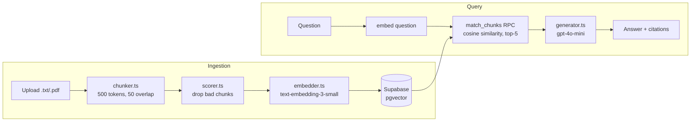

# DocQuery

A RAG (retrieval-augmented generation) Q&A system: upload a document, ask questions about it, get answers with inline citations back to the source text — and an honest "I don't know" when the document doesn't have the answer.


## Demo


*(recording pending — upload `corpus.txt`, ask a question, show a cited answer and one fallback response)*

## What makes this non-trivial

- **Chunk quality scoring** — not every chunk that comes out of a text splitter is worth embedding. `isUsableChunk` in [scorer.ts](backend/src/services/scorer.ts) rejects chunks under 100 characters and chunks where more than 40% of lines are duplicates (table headers, repeated boilerplate), so garbage doesn't make it into the vector store.
- **Cited answers, not just text** — retrieved chunks are numbered `[1]`, `[2]`, etc. in the prompt ([generator.ts](backend/src/services/generator.ts)), and the model is instructed to cite them inline. The API response returns the answer alongside the exact source chunks it cited.
- **Graceful fallback instead of hallucination** — if the best cosine similarity match is below 0.25 ([retriever.ts](backend/src/services/retriever.ts)), the system returns a fixed "I don't have enough information in the uploaded documents to answer this" instead of guessing. This is measured directly in the eval suite (see below).
- **Streamed answers with a non-streaming escape hatch** — `POST /api/query` streams tokens over SSE by default, so the answer appears as it's generated. `?stream=false` returns the original single-JSON response, which is what the eval runner consumes — the eval needs a complete answer to score, and shouldn't have to reassemble a stream to get one.
- **Per-document query scoping** — `match_chunks` takes an optional `filter_document_id`, so a query can search one document or all of them. Passing `null` searches everything, which keeps the eval on the same code path as the UI's "All documents" option.

## Architecture



Backend is Express + TypeScript, frontend is Next.js + Tailwind, talking over a plain REST API. Vector storage and similarity search run in Postgres via the `pgvector` extension on Supabase.

## Eval results

The eval suite ([run.ts](backend/src/eval/run.ts)) runs 30 question/answer pairs against a fixed corpus and checks three things:

| Metric | Result | Target |
|---|---|---|
| Retrieval hit rate | 93.1% | >80% |
| Answer faithfulness | 82.8% | >70% |
| Fallback accuracy | 100.0% | 100% |

- **Retrieval hit rate** — did the correct chunk show up in the top-5 results for a given question.
- **Answer faithfulness** — does the generated answer actually mention the concepts it's supposed to.
- **Fallback accuracy** — for questions with no relevant chunk in the corpus, does the system correctly say it doesn't know instead of making something up.

This runs in GitHub Actions on every push and fails the build if any threshold isn't met.

## Setup

**Supabase**

Run this in the SQL editor on a fresh Supabase project:

```sql
create extension if not exists vector;

create table documents (
  id uuid primary key default gen_random_uuid(),
  filename text not null,
  created_at timestamptz default now()
);

create table chunks (
  id uuid primary key default gen_random_uuid(),
  document_id uuid references documents(id) on delete cascade,
  content text not null,
  chunk_index integer not null,
  token_count integer not null,
  embedding vector(1536),
  created_at timestamptz default now()
);

create index on chunks using ivfflat (embedding vector_cosine_ops)
  with (lists = 100);

create or replace function match_chunks(
  query_embedding vector(1536),
  match_threshold float,
  match_count int,
  filter_document_id uuid default null
)
returns table(
  id uuid,
  document_id uuid,
  content text,
  similarity float,
  chunk_index integer,
  token_count integer
)
language sql stable
as $$
  select id, document_id, content,
         1 - (embedding <=> query_embedding) as similarity,
         chunk_index, token_count
  from chunks
  where 1 - (embedding <=> query_embedding) > match_threshold
    and (filter_document_id is null or document_id = filter_document_id)
  order by similarity desc
  limit match_count;
$$;
```

Use the `service_role` key (not `anon`) on the backend — the tables have RLS enabled by default on new Supabase projects.

Note that Supabase free-tier projects auto-pause after about a week of inactivity. When that happens every request fails with `TypeError: fetch failed` and the hostname stops resolving, which looks like a code bug but isn't — resume the project from the Supabase dashboard.

**Environment variables**

`backend/.env` (see `backend/.env.example`):

```
OPENAI_API_KEY=sk-...
SUPABASE_URL=https://your-project.supabase.co
SUPABASE_SERVICE_ROLE_KEY=eyJ...
PORT=3001
FRONTEND_URL=http://localhost:3000
RATE_LIMIT_MAX=200
```

`frontend/.env.local` (see `frontend/.env.local.example`):

```
NEXT_PUBLIC_API_URL=http://localhost:3001
```

**Run locally**

```bash
npm install
npm run dev       # starts backend (3001) and frontend (3000)

cd backend && npm run eval   # backend must already be running
```

## What I'd improve

- **Hybrid search** — pure vector similarity misses exact keyword/entity matches that BM25 would catch. Combining both would improve retrieval on queries with specific names or numbers.
- **Real PDF parsing** — the upload middleware accepts `application/pdf`, but ingestion reads the buffer as UTF-8, which turns a PDF into garbage before it's embedded. Either wire in a parser like `pdf-parse` or drop PDF from the accepted types; right now the UI advertises support that doesn't work.
- **Document deletion** — documents can be uploaded and listed but never removed through the API, so the only way to clear one is the eval reset script or the Supabase dashboard.
